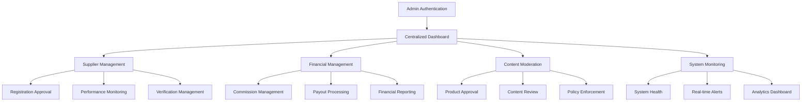

# Admin Management System Design

## Overview

This design document outlines the architecture and implementation approach for a comprehensive admin management system for the multivendor B2B marketplace platform. The system will provide platform administrators with centralized control, monitoring, and management capabilities while streamlining operations and maintaining platform quality.

## Architecture

### Current System Analysis

The existing system has:
- **Basic Admin Dashboard**: Limited overview with basic metrics
- **Supplier Management**: Basic approval and monitoring capabilities
- **Admin Oversight Service**: Performance monitoring and compliance tracking
- **Activity Logging**: Basic admin action tracking
- **Database Schema**: Comprehensive multivendor structure with supplier profiles, orders, products

### Target Architecture

The enhanced admin management system will provide:



## Components and Interfaces

### 1. Enhanced Admin Dashboard

#### Core Dashboard Components
```typescript
interface AdminDashboardData {
  // Key Performance Indicators
  kpis: {
    totalRevenue: number;
    monthlyGrowth: number;
    activeSuppliers: number;
    pendingApprovals: number;
    systemAlerts: number;
    orderVolume: number;
  };
  
  // Real-time Metrics
  realTimeMetrics: {
    onlineSuppliers: number;
    activeOrders: number;
    systemLoad: number;
    errorRate: number;
  };
  
  // Trend Data
  trends: {
    revenueChart: ChartData[];
    supplierGrowth: ChartData[];
    orderVolume: ChartData[];
  };
  
  // Recent Activity
  recentActivity: ActivityItem[];
  
  // System Alerts
  alerts: SystemAlert[];
}

interface SystemAlert {
  id: string;
  type: 'critical' | 'warning' | 'info';
  title: string;
  message: string;
  timestamp: Date;
  acknowledged: boolean;
  actionRequired: boolean;
}
```

#### Dashboard Layout Structure
```typescript
// Main Dashboard Layout
AdminDashboard/
├── DashboardHeader.tsx          // Title, quick actions, notifications
├── KPICards.tsx                 // Key performance indicators
├── AlertsPanel.tsx              // System alerts and notifications
├── MetricsCharts.tsx            // Revenue, growth, and trend charts
├── RecentActivity.tsx           // Recent admin and system activities
├── QuickActions.tsx             // Common admin tasks
└── SystemHealth.tsx             // System status and health metrics
```

### 2. Supplier Management System

#### Supplier Registration & Approval
```typescript
interface SupplierApprovalWorkflow {
  // Application Review
  applicationReview: {
    businessDocuments: DocumentReview[];
    riskAssessment: RiskScore;
    verificationChecks: VerificationCheck[];
    complianceStatus: ComplianceStatus;
  };
  
  // Approval Decision
  approvalDecision: {
    status: 'approved' | 'rejected' | 'pending_info';
    reason?: string;
    conditions?: string[];
    reviewerId: string;
    reviewDate: Date;
  };
  
  // Post-Approval Setup
  postApproval: {
    membershipTier: MembershipTier;
    commissionRate: number;
    featureAccess: FeatureAccess[];
    onboardingTasks: OnboardingTask[];
  };
}

// Supplier Management Components
SupplierManagement/
├── SupplierList.tsx             // All suppliers with filtering
├── ApprovalQueue.tsx            // Pending applications
├── SupplierDetails.tsx          // Individual supplier overview
├── DocumentReview.tsx           // Document verification interface
├── RiskAssessment.tsx           // Risk scoring and analysis
├── PerformanceMonitor.tsx       // Performance metrics and alerts
├── ComplianceTracker.tsx        // Policy compliance monitoring
└── BulkActions.tsx              // Bulk operations on suppliers
```

#### Performance Monitoring Dashboard
```typescript
interface SupplierPerformanceData {
  // Core Metrics
  metrics: {
    responseTime: number;
    fulfillmentRate: number;
    customerSatisfaction: number;
    orderAccuracy: number;
    disputeRate: number;
  };
  
  // Trend Analysis
  trends: {
    salesTrend: TrendData[];
    performanceTrend: TrendData[];
    complianceTrend: TrendData[];
  };
  
  // Risk Indicators
  riskFactors: {
    level: 'low' | 'medium' | 'high' | 'critical';
    factors: string[];
    recommendations: string[];
  };
  
  // Comparative Analysis
  benchmarks: {
    industryAverage: number;
    topPerformers: number;
    ranking: number;
  };
}
```

### 3. Financial Management System

#### Commission Management
```typescript
interface CommissionManagementSystem {
  // Rate Configuration
  rateConfiguration: {
    defaultRates: TierRates;
    categoryRates: CategoryRates;
    supplierOverrides: SupplierRates;
    promotionalRates: PromoRates;
  };
  
  // Revenue Tracking
  revenueTracking: {
    totalCommission: number;
    monthlyRevenue: number;
    projectedRevenue: number;
    revenueByTier: TierRevenue[];
  };
  
  // Impact Analysis
  impactAnalysis: {
    rateChangeImpact: ImpactProjection;
    supplierRetention: RetentionMetrics;
    competitiveAnalysis: CompetitiveData;
  };
}

// Financial Management Components
FinancialManagement/
├── CommissionSettings.tsx       // Rate configuration interface
├── RevenueAnalytics.tsx         // Revenue tracking and analysis
├── PayoutQueue.tsx              // Payout processing dashboard
├── FinancialReports.tsx         // Comprehensive financial reporting
├── TaxManagement.tsx            // Tax calculation and reporting
├── RefundProcessor.tsx          // Refund management system
└── AuditTrail.tsx               // Financial audit and compliance
```

#### Payout Processing System
```typescript
interface PayoutProcessingSystem {
  // Payout Queue Management
  payoutQueue: {
    pendingPayouts: PayoutItem[];
    scheduledPayouts: ScheduledPayout[];
    failedPayouts: FailedPayout[];
    completedPayouts: CompletedPayout[];
  };
  
  // Batch Processing
  batchProcessing: {
    batchSize: number;
    processingSchedule: Schedule;
    approvalWorkflow: ApprovalStep[];
    errorHandling: ErrorHandler;
  };
  
  // Payment Methods
  paymentMethods: {
    bankTransfer: BankTransferConfig;
    digitalWallets: WalletConfig[];
    cryptocurrencies: CryptoConfig[];
    internationalPayments: InternationalConfig;
  };
}
```

### 4. Content Moderation System

#### Product Approval Workflow
```typescript
interface ProductModerationSystem {
  // Automated Screening
  automatedScreening: {
    contentAnalysis: ContentAnalysisResult;
    imageRecognition: ImageAnalysisResult;
    policyCompliance: PolicyComplianceCheck;
    duplicateDetection: DuplicateDetectionResult;
  };
  
  // Manual Review
  manualReview: {
    reviewQueue: ReviewQueueItem[];
    reviewCriteria: ReviewCriteria[];
    reviewerAssignment: ReviewerAssignment;
    escalationRules: EscalationRule[];
  };
  
  // Quality Control
  qualityControl: {
    qualityMetrics: QualityMetric[];
    improvementSuggestions: Suggestion[];
    standardsEnforcement: StandardsCheck[];
  };
}

// Content Moderation Components
ContentModeration/
├── ProductReviewQueue.tsx       // Product approval interface
├── ContentAnalyzer.tsx          // Automated content analysis
├── PolicyEnforcement.tsx        // Policy compliance monitoring
├── QualityControl.tsx           // Quality assurance tools
├── BulkModeration.tsx           // Bulk approval/rejection tools
├── ModerationHistory.tsx        // Review history and analytics
└── ReviewerManagement.tsx       // Reviewer assignment and performance
```

### 5. System Monitoring & Analytics

#### Real-time Monitoring Dashboard
```typescript
interface SystemMonitoringData {
  // System Health
  systemHealth: {
    serverStatus: ServerStatus[];
    databasePerformance: DatabaseMetrics;
    apiResponseTimes: APIMetrics[];
    errorRates: ErrorMetrics[];
  };
  
  // Platform Analytics
  platformAnalytics: {
    userActivity: ActivityMetrics;
    transactionVolume: TransactionMetrics;
    systemUsage: UsageMetrics;
    performanceMetrics: PerformanceMetrics;
  };
  
  // Predictive Analytics
  predictiveAnalytics: {
    growthProjections: GrowthProjection[];
    churnPrediction: ChurnPrediction[];
    capacityPlanning: CapacityPlan[];
    riskForecasting: RiskForecast[];
  };
}

// System Monitoring Components
SystemMonitoring/
├── SystemHealthDashboard.tsx    // Real-time system status
├── PerformanceMetrics.tsx       // Performance monitoring
├── AlertManagement.tsx          // Alert configuration and handling
├── AnalyticsDashboard.tsx       // Platform analytics
├── ReportGenerator.tsx          // Custom report generation
├── PredictiveAnalytics.tsx      // Predictive insights
└── MaintenanceScheduler.tsx     // System maintenance planning
```

### 6. User & Access Management

#### Admin Role Management
```typescript
interface AdminAccessManagement {
  // Role Definitions
  roles: {
    superAdmin: Permission[];
    platformManager: Permission[];
    supplierManager: Permission[];
    contentModerator: Permission[];
    financialManager: Permission[];
    supportManager: Permission[];
  };
  
  // Permission System
  permissions: {
    read: ResourcePermission[];
    write: ResourcePermission[];
    delete: ResourcePermission[];
    approve: ResourcePermission[];
    configure: ResourcePermission[];
  };
  
  // Access Control
  accessControl: {
    ipWhitelist: string[];
    sessionTimeout: number;
    mfaRequired: boolean;
    auditLogging: boolean;
  };
}

// Access Management Components
AccessManagement/
├── AdminUserList.tsx            // Admin user management
├── RoleConfiguration.tsx        // Role and permission setup
├── AccessControl.tsx            // Access control settings
├── SessionManagement.tsx        // Active session monitoring
├── SecurityAudit.tsx            // Security audit logs
└── ComplianceReporting.tsx      // Compliance and audit reports
```

## Data Models

### Enhanced Admin Models
```typescript
// Admin Dashboard Models
interface AdminDashboardMetrics {
  id: string;
  date: Date;
  totalRevenue: number;
  totalCommission: number;
  activeSuppliers: number;
  pendingApprovals: number;
  systemAlerts: number;
  orderVolume: number;
  userActivity: number;
  systemLoad: number;
  errorRate: number;
  createdAt: Date;
}

// System Alert Models
interface SystemAlert {
  id: string;
  type: 'system' | 'security' | 'business' | 'compliance';
  severity: 'low' | 'medium' | 'high' | 'critical';
  title: string;
  message: string;
  source: string;
  entityId?: string;
  entityType?: string;
  acknowledged: boolean;
  acknowledgedBy?: string;
  acknowledgedAt?: Date;
  resolved: boolean;
  resolvedBy?: string;
  resolvedAt?: Date;
  resolution?: string;
  createdAt: Date;
  updatedAt: Date;
}

// Admin Activity Models
interface AdminActivity {
  id: string;
  adminId: string;
  adminName: string;
  action: string;
  description: string;
  entityType: string;
  entityId?: string;
  entityName?: string;
  previousValue?: any;
  newValue?: any;
  ipAddress?: string;
  userAgent?: string;
  sessionId?: string;
  createdAt: Date;
}
```

### Financial Management Models
```typescript
// Commission Configuration
interface CommissionConfiguration {
  id: string;
  name: string;
  description: string;
  
  // Default Rates
  defaultRate: number;
  
  // Tier-based Rates
  tierRates: {
    free: number;
    silver: number;
    gold: number;
    platinum: number;
  };
  
  // Category-based Rates
  categoryRates: Record<string, number>;
  
  // Supplier Overrides
  supplierOverrides: Record<string, number>;
  
  // Promotional Rates
  promotionalRates: {
    rate: number;
    startDate: Date;
    endDate: Date;
    conditions: string[];
  }[];
  
  effectiveDate: Date;
  createdBy: string;
  createdAt: Date;
  updatedAt: Date;
}

// Payout Management
interface PayoutBatch {
  id: string;
  batchNumber: string;
  totalAmount: number;
  totalPayouts: number;
  status: 'pending' | 'processing' | 'completed' | 'failed';
  
  payouts: PayoutItem[];
  
  scheduledDate: Date;
  processedDate?: Date;
  completedDate?: Date;
  
  processedBy?: string;
  approvedBy?: string;
  
  failureReason?: string;
  retryCount: number;
  
  createdAt: Date;
  updatedAt: Date;
}
```

## API Routes Structure

### Admin Dashboard Routes
```typescript
// Dashboard Analytics
GET    /api/admin/dashboard/metrics
GET    /api/admin/dashboard/kpis
GET    /api/admin/dashboard/trends
GET    /api/admin/dashboard/alerts
GET    /api/admin/dashboard/activity

// Real-time Data
GET    /api/admin/dashboard/realtime/metrics
GET    /api/admin/dashboard/realtime/alerts
POST   /api/admin/dashboard/alerts/:id/acknowledge
POST   /api/admin/dashboard/alerts/:id/resolve
```

### Enhanced Supplier Management Routes
```typescript
// Supplier Administration
GET    /api/admin/suppliers/overview
GET    /api/admin/suppliers/pending
GET    /api/admin/suppliers/performance
POST   /api/admin/suppliers/:id/approve
POST   /api/admin/suppliers/:id/reject
POST   /api/admin/suppliers/:id/suspend
POST   /api/admin/suppliers/:id/reactivate

// Bulk Operations
POST   /api/admin/suppliers/bulk/approve
POST   /api/admin/suppliers/bulk/reject
POST   /api/admin/suppliers/bulk/update-tier
POST   /api/admin/suppliers/bulk/update-commission

// Performance Monitoring
GET    /api/admin/suppliers/:id/performance/detailed
GET    /api/admin/suppliers/:id/risk-assessment
GET    /api/admin/suppliers/:id/compliance-history
POST   /api/admin/suppliers/:id/performance/flag
```

### Financial Management Routes
```typescript
// Commission Management
GET    /api/admin/financial/commission/settings
PUT    /api/admin/financial/commission/settings
GET    /api/admin/financial/commission/impact-analysis
POST   /api/admin/financial/commission/simulate-changes

// Payout Management
GET    /api/admin/financial/payouts/queue
POST   /api/admin/financial/payouts/process-batch
GET    /api/admin/financial/payouts/history
POST   /api/admin/financial/payouts/:id/retry
POST   /api/admin/financial/payouts/:id/cancel

// Financial Reporting
GET    /api/admin/financial/reports/revenue
GET    /api/admin/financial/reports/commission
GET    /api/admin/financial/reports/payouts
POST   /api/admin/financial/reports/generate
```

### Content Moderation Routes
```typescript
// Product Moderation
GET    /api/admin/moderation/products/queue
POST   /api/admin/moderation/products/:id/approve
POST   /api/admin/moderation/products/:id/reject
POST   /api/admin/moderation/products/bulk/moderate

// Content Analysis
POST   /api/admin/moderation/analyze/content
POST   /api/admin/moderation/analyze/images
GET    /api/admin/moderation/policies
PUT    /api/admin/moderation/policies/:id

// Quality Control
GET    /api/admin/moderation/quality/metrics
POST   /api/admin/moderation/quality/run-checks
GET    /api/admin/moderation/quality/reports
```

### System Monitoring Routes
```typescript
// System Health
GET    /api/admin/monitoring/system/health
GET    /api/admin/monitoring/system/performance
GET    /api/admin/monitoring/system/errors
GET    /api/admin/monitoring/system/capacity

// Platform Analytics
GET    /api/admin/analytics/platform/overview
GET    /api/admin/analytics/platform/trends
GET    /api/admin/analytics/platform/predictions
POST   /api/admin/analytics/reports/custom

// Alert Management
GET    /api/admin/monitoring/alerts/active
POST   /api/admin/monitoring/alerts/configure
PUT    /api/admin/monitoring/alerts/:id/settings
```

## Error Handling

### Comprehensive Error Management
```typescript
interface AdminErrorHandler {
  // Error Categories
  systemErrors: SystemError[];
  businessErrors: BusinessError[];
  securityErrors: SecurityError[];
  dataErrors: DataError[];
  
  // Error Response Strategy
  errorResponse: {
    userFriendlyMessage: string;
    technicalDetails: string;
    errorCode: string;
    severity: 'low' | 'medium' | 'high' | 'critical';
    actionRequired: boolean;
    suggestedActions: string[];
  };
  
  // Error Recovery
  recoveryOptions: {
    automaticRetry: boolean;
    manualIntervention: boolean;
    rollbackRequired: boolean;
    escalationNeeded: boolean;
  };
}
```

## Testing Strategy

### Comprehensive Testing Approach
```typescript
// Unit Tests
AdminUnitTests/
├── DashboardMetrics.test.ts     // Dashboard calculation logic
├── CommissionCalculation.test.ts // Commission calculation accuracy
├── PayoutProcessing.test.ts     // Payout processing logic
├── PermissionSystem.test.ts     // Access control validation
└── AlertSystem.test.ts          // Alert generation and handling

// Integration Tests
AdminIntegrationTests/
├── SupplierApprovalFlow.test.ts // End-to-end approval process
├── PayoutWorkflow.test.ts       // Complete payout workflow
├── ContentModeration.test.ts    // Product approval process
├── SystemMonitoring.test.ts     // Monitoring and alerting
└── ReportGeneration.test.ts     // Report generation accuracy

// Performance Tests
AdminPerformanceTests/
├── DashboardLoading.test.ts     // Dashboard load performance
├── BulkOperations.test.ts       // Bulk operation performance
├── ReportGeneration.test.ts     // Large report generation
└── ConcurrentAccess.test.ts     // Multiple admin concurrent access

// Security Tests
AdminSecurityTests/
├── AccessControl.test.ts        // Permission enforcement
├── DataIsolation.test.ts        // Admin data access boundaries
├── AuditLogging.test.ts         // Audit trail completeness
└── SessionSecurity.test.ts      // Session management security
```

## Implementation Phases

### Phase 1: Enhanced Dashboard & Core Admin Features (Weeks 1-2)
- Redesign admin dashboard with comprehensive KPIs
- Implement real-time metrics and alerting system
- Enhance supplier management interface
- Add bulk operations for supplier management

### Phase 2: Financial Management System (Weeks 3-4)
- Build comprehensive commission management interface
- Implement advanced payout processing system
- Create financial reporting and analytics
- Add tax management and compliance features

### Phase 3: Content Moderation & Quality Control (Weeks 5-6)
- Develop automated content screening system
- Build manual review workflow interface
- Implement quality control metrics and monitoring
- Add bulk moderation capabilities

### Phase 4: Advanced Analytics & Monitoring (Weeks 7-8)
- Create comprehensive system monitoring dashboard
- Implement predictive analytics features
- Build custom report generation system
- Add performance optimization recommendations

### Phase 5: Security & Compliance (Weeks 9-10)
- Enhance admin access control and permissions
- Implement comprehensive audit logging
- Add compliance reporting features
- Create security monitoring and alerting

This design provides a comprehensive foundation for implementing a world-class admin management system that will enable efficient platform operation, maintain quality standards, and support business growth while ensuring security and compliance.
</content>