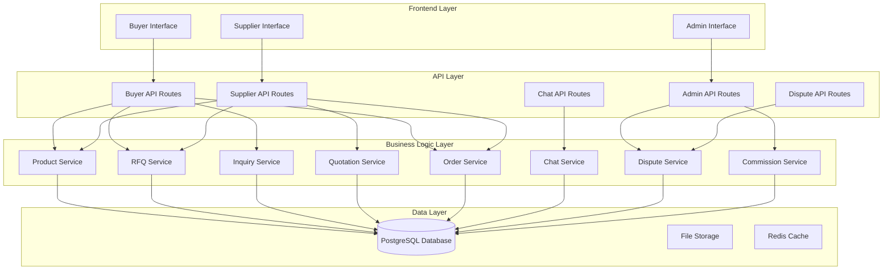
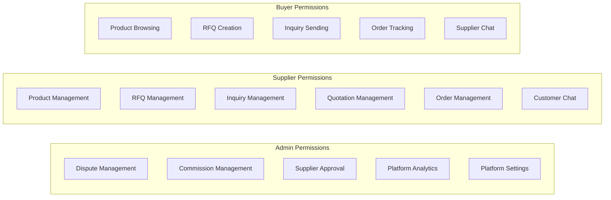

# B2B Marketplace System Restructure Design

## Overview

This design document outlines the comprehensive restructuring of the existing multivendor B2B marketplace platform. The system will be transformed from a mixed admin-supplier model to a true multivendor platform with clear role separation: Admins manage platform oversight and disputes, Suppliers handle their business operations, and Buyers have full product discovery and purchasing capabilities.

## Architecture

### System Architecture Diagram



### Role-Based Access Control



## Components and Interfaces

### 1. Buyer System Components

#### Product Discovery Interface
- **AdvancedProductFilters**: Dynamic filtering by category, price, MOQ, supplier, location
- **ProductGrid**: Responsive grid layout with infinite scroll
- **ProductCard**: Product preview with supplier info and quick actions
- **SearchBar**: Real-time search with autocomplete and suggestions

#### Product Detail Interface
- **ProductDetailPage**: Comprehensive product information display
- **ProductImageGallery**: Multiple images and videos with zoom functionality
- **SupplierInfoCard**: Supplier details with verification badges
- **PricingTiers**: Quantity-based pricing display
- **ProductSpecifications**: Detailed technical specifications
- **RelatedProducts**: Similar products from same supplier

#### RFQ and Inquiry Interface
- **RFQCreationForm**: Detailed RFQ creation with specifications
- **InquiryForm**: Quick inquiry form for product questions
- **QuotationComparison**: Side-by-side quotation comparison
- **RFQDashboard**: Buyer's RFQ management interface

### 2. Supplier System Components

#### Business Management Interface
- **SupplierRFQManager**: RFQ response and management system
- **InquiryManager**: Customer inquiry handling system
- **QuotationCreator**: Detailed quotation creation tool
- **OrderManager**: Order processing and fulfillment system

#### Product Management Interface
- **ProductManager**: Enhanced product CRUD operations
- **BulkUploadTool**: Excel/CSV bulk product upload
- **ProductAnalytics**: Product performance metrics
- **InventoryManager**: Stock level management

### 3. Admin System Components

#### Dispute Management Interface
- **DisputeQueue**: Pending disputes requiring admin attention
- **DisputeDetailView**: Comprehensive dispute information and evidence
- **MediationTools**: Admin tools for dispute resolution
- **RefundProcessor**: Automated refund processing system

#### Platform Management Interface
- **CommissionDashboard**: Commission tracking and analytics
- **SupplierApprovalQueue**: Supplier verification workflow
- **PlatformAnalytics**: System-wide performance metrics
- **SettingsManager**: Platform configuration management

### 4. Chat System Components

#### Universal Chat Interface
- **ChatWindow**: Real-time messaging interface
- **ConversationList**: Chat history and active conversations
- **FileUpload**: Document and image sharing
- **ProductReference**: In-chat product linking and previews

## Data Models

### Enhanced Database Schema

```sql
-- Buyers table (enhanced)
CREATE TABLE buyers (
    id UUID PRIMARY KEY DEFAULT gen_random_uuid(),
    user_id UUID REFERENCES users(id),
    company_name VARCHAR(255),
    industry VARCHAR(100),
    business_type VARCHAR(50),
    annual_volume DECIMAL(15,2),
    preferred_payment_terms TEXT[],
    created_at TIMESTAMP DEFAULT NOW(),
    updated_at TIMESTAMP DEFAULT NOW()
);

-- RFQs table (buyer-centric)
CREATE TABLE rfqs (
    id UUID PRIMARY KEY DEFAULT gen_random_uuid(),
    buyer_id UUID REFERENCES buyers(id),
    title VARCHAR(255) NOT NULL,
    description TEXT,
    category_id UUID REFERENCES categories(id),
    specifications JSONB,
    quantity INTEGER NOT NULL,
    target_price DECIMAL(10,2),
    budget_range JSONB, -- {min: 1000, max: 5000}
    delivery_location VARCHAR(255),
    required_delivery_date DATE,
    payment_terms VARCHAR(100),
    status VARCHAR(50) DEFAULT 'open', -- open, closed, expired
    expires_at TIMESTAMP,
    created_at TIMESTAMP DEFAULT NOW(),
    updated_at TIMESTAMP DEFAULT NOW()
);

-- Inquiries table (buyer-supplier communication)
CREATE TABLE inquiries (
    id UUID PRIMARY KEY DEFAULT gen_random_uuid(),
    buyer_id UUID REFERENCES buyers(id),
    supplier_id UUID REFERENCES suppliers(id),
    product_id UUID REFERENCES products(id),
    subject VARCHAR(255),
    message TEXT NOT NULL,
    quantity INTEGER,
    status VARCHAR(50) DEFAULT 'pending', -- pending, responded, closed
    created_at TIMESTAMP DEFAULT NOW(),
    updated_at TIMESTAMP DEFAULT NOW()
);

-- Quotations table (supplier responses)
CREATE TABLE quotations (
    id UUID PRIMARY KEY DEFAULT gen_random_uuid(),
    supplier_id UUID REFERENCES suppliers(id),
    rfq_id UUID REFERENCES rfqs(id),
    inquiry_id UUID REFERENCES inquiries(id),
    unit_price DECIMAL(10,2) NOT NULL,
    total_price DECIMAL(15,2) NOT NULL,
    moq INTEGER NOT NULL,
    lead_time VARCHAR(50),
    payment_terms VARCHAR(100),
    validity_period INTEGER, -- days
    terms_conditions TEXT,
    attachments TEXT[],
    status VARCHAR(50) DEFAULT 'sent', -- sent, accepted, rejected, expired
    created_at TIMESTAMP DEFAULT NOW(),
    updated_at TIMESTAMP DEFAULT NOW()
);

-- Disputes table (admin-managed)
CREATE TABLE disputes (
    id UUID PRIMARY KEY DEFAULT gen_random_uuid(),
    order_id UUID REFERENCES orders(id),
    buyer_id UUID REFERENCES buyers(id),
    supplier_id UUID REFERENCES suppliers(id),
    admin_id UUID REFERENCES users(id),
    dispute_type VARCHAR(50), -- quality, delivery, payment, other
    description TEXT NOT NULL,
    buyer_evidence TEXT[],
    supplier_evidence TEXT[],
    admin_notes TEXT,
    status VARCHAR(50) DEFAULT 'open', -- open, investigating, resolved, closed
    resolution TEXT,
    refund_amount DECIMAL(10,2),
    resolved_at TIMESTAMP,
    created_at TIMESTAMP DEFAULT NOW(),
    updated_at TIMESTAMP DEFAULT NOW()
);

-- Chat conversations
CREATE TABLE conversations (
    id UUID PRIMARY KEY DEFAULT gen_random_uuid(),
    type VARCHAR(50) NOT NULL, -- buyer_supplier, buyer_admin, supplier_admin
    buyer_id UUID REFERENCES buyers(id),
    supplier_id UUID REFERENCES suppliers(id),
    admin_id UUID REFERENCES users(id),
    subject VARCHAR(255),
    status VARCHAR(50) DEFAULT 'active', -- active, archived, closed
    last_message_at TIMESTAMP,
    created_at TIMESTAMP DEFAULT NOW(),
    updated_at TIMESTAMP DEFAULT NOW()
);

-- Chat messages
CREATE TABLE messages (
    id UUID PRIMARY KEY DEFAULT gen_random_uuid(),
    conversation_id UUID REFERENCES conversations(id),
    sender_id UUID REFERENCES users(id),
    sender_type VARCHAR(20) NOT NULL, -- buyer, supplier, admin
    message TEXT NOT NULL,
    attachments TEXT[],
    product_references UUID[],
    is_read BOOLEAN DEFAULT FALSE,
    created_at TIMESTAMP DEFAULT NOW()
);

-- Product filters and categories (enhanced)
CREATE TABLE categories (
    id UUID PRIMARY KEY DEFAULT gen_random_uuid(),
    name VARCHAR(100) NOT NULL,
    slug VARCHAR(100) UNIQUE NOT NULL,
    parent_id UUID REFERENCES categories(id),
    description TEXT,
    image_url VARCHAR(500),
    is_active BOOLEAN DEFAULT TRUE,
    sort_order INTEGER DEFAULT 0,
    created_at TIMESTAMP DEFAULT NOW()
);

-- Product attributes for filtering
CREATE TABLE product_attributes (
    id UUID PRIMARY KEY DEFAULT gen_random_uuid(),
    product_id UUID REFERENCES products(id),
    attribute_name VARCHAR(100) NOT NULL,
    attribute_value TEXT NOT NULL,
    is_filterable BOOLEAN DEFAULT TRUE,
    created_at TIMESTAMP DEFAULT NOW()
);
```

## Error Handling

### Error Response Structure
```typescript
interface APIError {
  code: string;
  message: string;
  details?: any;
  timestamp: string;
  path: string;
}
```

### Error Categories
1. **Authentication Errors**: Invalid credentials, expired tokens
2. **Authorization Errors**: Insufficient permissions, role restrictions
3. **Validation Errors**: Invalid input data, missing required fields
4. **Business Logic Errors**: RFQ expired, insufficient inventory
5. **System Errors**: Database connection, external service failures

### Error Handling Strategy
- Client-side validation for immediate feedback
- Server-side validation for security and data integrity
- Graceful degradation for non-critical features
- User-friendly error messages with actionable guidance
- Comprehensive error logging for debugging

## Testing Strategy

### Unit Testing
- Service layer business logic testing
- Component isolation testing
- Database query testing
- Utility function testing

### Integration Testing
- API endpoint testing
- Database integration testing
- Third-party service integration
- Role-based access control testing

### End-to-End Testing
- Complete user workflows (buyer journey, supplier operations)
- Cross-role interactions (buyer-supplier communication)
- Admin dispute resolution workflows
- Payment and commission processing

### Performance Testing
- Database query optimization
- API response time testing
- Concurrent user load testing
- File upload performance testing

### Security Testing
- Authentication and authorization testing
- Input validation and sanitization
- SQL injection prevention
- XSS protection testing
- File upload security testing

## Implementation Phases

### Phase 1: Core System Restructure
1. Remove admin RFQ/inquiry/quotation management
2. Implement proper role-based access control
3. Create buyer product discovery system
4. Enhance supplier business management tools

### Phase 2: Advanced Features
1. Implement comprehensive dispute management
2. Create multi-role chat system
3. Add advanced product filtering
4. Implement quotation comparison tools

### Phase 3: Optimization and Polish
1. Performance optimization
2. Code cleanup and refactoring
3. Enhanced error handling
4. Comprehensive testing implementation

## Security Considerations

### Data Protection
- Role-based data access restrictions
- Encrypted sensitive data storage
- Secure file upload handling
- Input validation and sanitization

### Authentication & Authorization
- JWT token-based authentication
- Role-based permission system
- Session management
- Two-factor authentication support

### API Security
- Rate limiting implementation
- CORS configuration
- Request validation
- SQL injection prevention

## Performance Optimization

### Database Optimization
- Proper indexing strategy
- Query optimization
- Connection pooling
- Caching frequently accessed data

### Frontend Optimization
- Code splitting and lazy loading
- Image optimization
- Infinite scroll for large datasets
- Debounced search functionality

### API Optimization
- Response caching
- Pagination implementation
- Field selection optimization
- Batch operations support