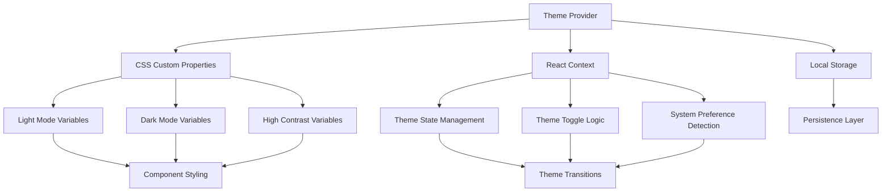
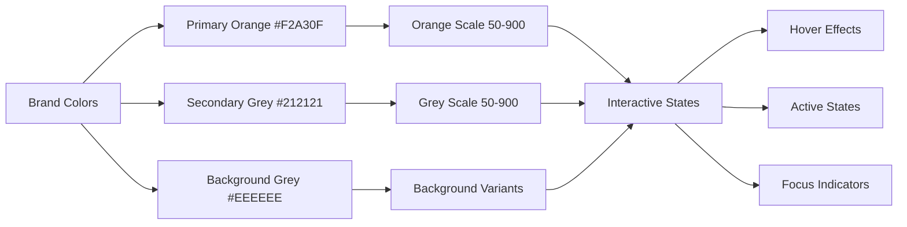

# Enhanced Theme System Design

## Overview

This design document outlines the implementation of a comprehensive theme system for the B2B marketplace that provides well-balanced light and dark modes using the specified brand colors: Orange (#F2A30F), Dark Grey (#212121), and Light Grey Background (#EEEEEE). The system will use Base Neue font family throughout and ensure consistent visual hierarchy, accessibility compliance, and smooth theme transitions.

## Architecture

### Theme System Architecture



### Color System Hierarchy



## Components and Interfaces

### 1. Theme Provider Component

**Purpose:** Central theme management and context provision

**Interface:**
```typescript
interface ThemeContextType {
  theme: 'light' | 'dark' | 'system';
  resolvedTheme: 'light' | 'dark';
  setTheme: (theme: 'light' | 'dark' | 'system') => void;
  toggleTheme: () => void;
  isHighContrast: boolean;
  setHighContrast: (enabled: boolean) => void;
}

interface ThemeProviderProps {
  children: React.ReactNode;
  defaultTheme?: 'light' | 'dark' | 'system';
  storageKey?: string;
  enableSystem?: boolean;
  disableTransitionOnChange?: boolean;
}
```

**Key Features:**
- System preference detection
- Persistent theme storage
- Smooth theme transitions
- High contrast mode support
- SSR compatibility

### 2. Theme Toggle Component

**Purpose:** User interface for theme switching

**Interface:**
```typescript
interface ThemeToggleProps {
  variant?: 'button' | 'switch' | 'dropdown';
  size?: 'sm' | 'md' | 'lg';
  showLabel?: boolean;
  className?: string;
}
```

**Variants:**
- **Button:** Simple toggle button with icon
- **Switch:** Toggle switch with smooth animation
- **Dropdown:** Dropdown with light/dark/system options

### 3. Enhanced CSS Custom Properties System

**Purpose:** Comprehensive color token system with proper light/dark mode support

**Structure:**
```css
:root {
  /* Brand Color Tokens */
  --brand-orange-50: 39 100% 95%;
  --brand-orange-500: 39 100% 47%; /* Adjusted #F2A30F */
  --brand-orange-600: 39 90% 42%;
  
  --brand-grey-50: 0 0% 95%;
  --brand-grey-900: 0 0% 13%; /* Adjusted #212121 */
  
  --brand-background: 0 0% 93%; /* Adjusted #EEEEEE */
  
  /* Semantic Color Tokens */
  --background: var(--brand-background);
  --foreground: var(--brand-grey-900);
  --primary: var(--brand-orange-500);
  --secondary: var(--brand-grey-900);
  
  /* Interactive State Tokens */
  --hover-elevation: rgba(0, 0, 0, 0.04);
  --active-elevation: rgba(0, 0, 0, 0.08);
  --focus-ring: var(--brand-orange-500);
}

.dark {
  /* Dark Mode Adjustments */
  --brand-orange-500: 39 100% 52%; /* Brighter for dark backgrounds */
  --brand-grey-50: 0 0% 8%; /* Very dark background */
  --brand-grey-900: 0 0% 95%; /* Light text */
  
  --background: var(--brand-grey-50);
  --foreground: var(--brand-grey-900);
  
  --hover-elevation: rgba(255, 255, 255, 0.05);
  --active-elevation: rgba(255, 255, 255, 0.1);
}
```

### 4. Typography System Enhancement

**Purpose:** Consistent Base Neue font implementation with proper loading

**Font Loading Strategy:**
```css
@font-face {
  font-family: 'Base Neue';
  src: url('/fonts/base-neue-regular.woff2') format('woff2');
  font-weight: 400;
  font-style: normal;
  font-display: swap;
}

/* Font utility classes */
.font-base-neue {
  font-family: 'Base Neue', 'Inter', system-ui, sans-serif;
}

.font-base-neue-mono {
  font-family: 'Base Neue Mono', 'Consolas', monospace;
}
```

**Fallback Strategy:**
- Primary: Base Neue
- Secondary: Inter (already loaded)
- Tertiary: System fonts

## Data Models

### Theme Configuration Model

```typescript
interface ThemeConfig {
  colors: {
    light: ColorPalette;
    dark: ColorPalette;
    highContrast: ColorPalette;
  };
  fonts: FontConfig;
  transitions: TransitionConfig;
  breakpoints: BreakpointConfig;
}

interface ColorPalette {
  primary: ColorScale;
  secondary: ColorScale;
  background: ColorScale;
  foreground: ColorScale;
  accent: ColorScale;
  muted: ColorScale;
  border: ColorScale;
}

interface ColorScale {
  50: string;
  100: string;
  200: string;
  300: string;
  400: string;
  500: string; // Base color
  600: string;
  700: string;
  800: string;
  900: string;
}

interface FontConfig {
  families: {
    sans: string[];
    serif: string[];
    mono: string[];
  };
  weights: number[];
  sizes: Record<string, string>;
  lineHeights: Record<string, string>;
}

interface TransitionConfig {
  duration: {
    fast: string;
    normal: string;
    slow: string;
  };
  easing: {
    ease: string;
    easeIn: string;
    easeOut: string;
    easeInOut: string;
  };
}
```

### Theme State Model

```typescript
interface ThemeState {
  current: 'light' | 'dark';
  preference: 'light' | 'dark' | 'system';
  systemPreference: 'light' | 'dark';
  isHighContrast: boolean;
  isTransitioning: boolean;
  lastChanged: Date;
}
```

## Error Handling

### Theme Loading Errors

**Font Loading Failures:**
- Graceful fallback to system fonts
- Loading state indicators
- Error reporting for monitoring

**CSS Variable Failures:**
- Fallback color values in CSS
- Browser compatibility checks
- Progressive enhancement approach

**Storage Failures:**
- Default theme application
- Session-based fallback
- Error boundary implementation

### Theme Transition Errors

**Animation Interruptions:**
- Cleanup of incomplete transitions
- State synchronization
- Performance monitoring

**State Synchronization Issues:**
- Conflict resolution between system and user preferences
- Race condition handling
- Consistent state recovery

## Testing Strategy

### Unit Tests

**Theme Provider Tests:**
```typescript
describe('ThemeProvider', () => {
  test('should initialize with system preference', () => {
    // Test system preference detection
  });
  
  test('should persist theme selection', () => {
    // Test localStorage integration
  });
  
  test('should handle theme transitions smoothly', () => {
    // Test transition animations
  });
  
  test('should support high contrast mode', () => {
    // Test accessibility features
  });
});
```

**Color System Tests:**
```typescript
describe('Color System', () => {
  test('should maintain proper contrast ratios', () => {
    // Test WCAG compliance
  });
  
  test('should provide consistent color scales', () => {
    // Test color generation
  });
  
  test('should handle dark mode adjustments', () => {
    // Test dark mode color variations
  });
});
```

### Integration Tests

**Component Theme Integration:**
- Test all components with both themes
- Verify color consistency across components
- Test theme switching behavior

**Performance Tests:**
- Theme switching performance
- Font loading performance
- CSS custom property performance

### Visual Regression Tests

**Theme Consistency:**
- Screenshot comparison between themes
- Component appearance verification
- Cross-browser compatibility

**Accessibility Tests:**
- Contrast ratio verification
- Focus indicator visibility
- Screen reader compatibility

### E2E Tests

**User Workflow Tests:**
```typescript
describe('Theme User Experience', () => {
  test('user can toggle between light and dark modes', async () => {
    // Test complete theme switching workflow
  });
  
  test('theme preference persists across sessions', async () => {
    // Test persistence behavior
  });
  
  test('system preference is respected by default', async () => {
    // Test system integration
  });
});
```

## Implementation Details

### CSS Custom Properties Strategy

**Naming Convention:**
- `--brand-{color}-{scale}` for brand colors
- `--semantic-{purpose}` for semantic tokens
- `--component-{name}-{property}` for component-specific tokens

**Color Calculation:**
```css
/* Automatic hover state calculation */
.button-primary {
  background-color: hsl(var(--brand-orange-500));
  transition: background-color 200ms ease;
}

.button-primary:hover {
  background-color: hsl(var(--brand-orange-600));
}

/* Dark mode automatic adjustment */
.dark .button-primary {
  background-color: hsl(var(--brand-orange-500)); /* Automatically brighter */
}
```

### Component Integration Pattern

**Theme-Aware Component Example:**
```typescript
interface ButtonProps {
  variant?: 'primary' | 'secondary' | 'outline';
  size?: 'sm' | 'md' | 'lg';
  className?: string;
}

const Button = ({ variant = 'primary', size = 'md', className, ...props }: ButtonProps) => {
  return (
    <button
      className={cn(
        // Base styles
        'font-base-neue font-medium transition-all duration-200',
        'focus:outline-none focus:ring-2 focus:ring-brand-orange-500 focus:ring-offset-2',
        
        // Variant styles
        {
          'bg-brand-orange-500 text-white hover:bg-brand-orange-600 active:bg-brand-orange-700': variant === 'primary',
          'bg-brand-grey-900 text-white hover:bg-brand-grey-800 active:bg-brand-grey-700': variant === 'secondary',
          'border-2 border-brand-orange-500 text-brand-orange-500 hover:bg-brand-orange-500 hover:text-white': variant === 'outline',
        },
        
        // Size styles
        {
          'px-3 py-1.5 text-sm': size === 'sm',
          'px-4 py-2 text-base': size === 'md',
          'px-6 py-3 text-lg': size === 'lg',
        },
        
        className
      )}
      {...props}
    />
  );
};
```

### Performance Optimizations

**CSS Loading Strategy:**
1. Critical CSS inlined in HTML
2. Theme-specific CSS loaded asynchronously
3. Font loading with `font-display: swap`
4. CSS custom property caching

**JavaScript Optimizations:**
1. Theme state memoization
2. Debounced theme switching
3. Lazy loading of theme utilities
4. Efficient re-render prevention

### Accessibility Enhancements

**High Contrast Mode:**
```css
.high-contrast {
  --brand-orange-500: 39 100% 25%; /* Much darker orange */
  --brand-grey-900: 0 0% 0%; /* Pure black */
  --background: 0 0% 100%; /* Pure white */
  
  /* Enhanced borders and outlines */
  --focus-ring-width: 3px;
  --border-width: 2px;
}

.high-contrast.dark {
  --brand-orange-500: 39 100% 75%; /* Much brighter orange */
  --brand-grey-900: 0 0% 100%; /* Pure white */
  --background: 0 0% 0%; /* Pure black */
}
```

**Focus Management:**
- Visible focus indicators in both themes
- Proper focus trap in modals
- Keyboard navigation support
- Screen reader announcements for theme changes

### Browser Compatibility

**CSS Custom Properties:**
- Fallback values for older browsers
- Progressive enhancement approach
- Polyfill for IE11 if needed

**Modern Features:**
- `prefers-color-scheme` media query
- `color-mix()` function where supported
- CSS `@supports` for feature detection

This design ensures a professional, accessible, and performant theme system that maintains brand consistency while providing an excellent user experience across all devices and accessibility needs.