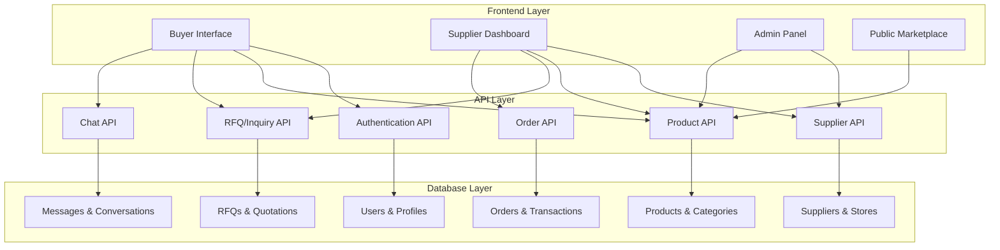

# Design Document

## Overview

This design document outlines the transformation of the existing B2B ecommerce platform into a comprehensive multivendor marketplace. The system will shift from a centralized admin-managed model to a decentralized supplier-managed ecosystem while maintaining the existing technical foundation built with React, Node.js, PostgreSQL, and Drizzle ORM.

## Architecture

### Current System Analysis

The existing system has:
- **Frontend**: React with TypeScript, Tailwind CSS, shadcn/ui components
- **Backend**: Node.js with Express, PostgreSQL database, Drizzle ORM
- **Authentication**: Role-based system (buyer, admin)
- **Features**: Product management, RFQ/inquiry system, chat, orders

### Target Architecture

The multivendor transformation will:
- **Add Supplier Role**: New user type with independent business capabilities
- **Decentralize Operations**: Move RFQ/inquiry/quotation management from admin to suppliers
- **Maintain Platform Oversight**: Admin focuses on verification, moderation, and analytics
- **Preserve User Experience**: Buyers continue with familiar interface but enhanced supplier discovery

### System Components



## Components and Interfaces

### 1. Database Schema Extensions

#### Supplier Profile Table
```sql
CREATE TABLE supplier_profiles (
  id VARCHAR PRIMARY KEY DEFAULT gen_random_uuid(),
  user_id VARCHAR NOT NULL UNIQUE,
  business_name TEXT NOT NULL,
  business_type TEXT NOT NULL, -- 'manufacturer', 'trading_company', 'wholesaler'
  store_name TEXT NOT NULL UNIQUE,
  store_slug TEXT NOT NULL UNIQUE,
  store_description TEXT,
  store_logo TEXT,
  store_banner TEXT,
  
  -- Contact Information
  contact_person TEXT NOT NULL,
  position TEXT,
  phone TEXT NOT NULL,
  whatsapp TEXT,
  address TEXT NOT NULL,
  city TEXT NOT NULL,
  country TEXT NOT NULL,
  website TEXT,
  
  -- Business Details
  year_established INTEGER,
  employees_count TEXT,
  annual_revenue TEXT,
  main_products TEXT[],
  export_markets TEXT[],
  
  -- Verification & Status
  verification_level TEXT DEFAULT 'none', -- 'none', 'basic', 'business', 'premium'
  verification_documents JSONB,
  is_verified BOOLEAN DEFAULT false,
  verified_at TIMESTAMP,
  
  -- Performance Metrics
  rating DECIMAL DEFAULT 0,
  total_reviews INTEGER DEFAULT 0,
  response_rate DECIMAL DEFAULT 0,
  response_time TEXT, -- '< 2 hours'
  total_sales DECIMAL DEFAULT 0,
  total_orders INTEGER DEFAULT 0,
  
  -- Status
  status TEXT DEFAULT 'pending', -- 'pending', 'approved', 'rejected', 'suspended'
  is_active BOOLEAN DEFAULT false,
  is_featured BOOLEAN DEFAULT false,
  
  -- Commission
  commission_rate DECIMAL, -- Override default platform commission
  
  -- Store Settings
  store_policies JSONB,
  operating_hours JSONB,
  
  created_at TIMESTAMP DEFAULT NOW(),
  updated_at TIMESTAMP DEFAULT NOW()
);
```

#### Product Table Updates
```sql
-- Add supplier_id to existing products table
ALTER TABLE products ADD COLUMN supplier_id VARCHAR;
ALTER TABLE products ADD COLUMN approval_status TEXT DEFAULT 'pending'; -- 'pending', 'approved', 'rejected'
ALTER TABLE products ADD COLUMN approved_by VARCHAR; -- admin_id
ALTER TABLE products ADD COLUMN approved_at TIMESTAMP;
ALTER TABLE products ADD COLUMN rejection_reason TEXT;

-- Create index for supplier products
CREATE INDEX idx_products_supplier_id ON products(supplier_id);
CREATE INDEX idx_products_approval_status ON products(approval_status);
```

#### RFQ/Inquiry Table Updates
```sql
-- Add supplier_id to route inquiries to specific suppliers
ALTER TABLE inquiries ADD COLUMN supplier_id VARCHAR;
ALTER TABLE rfqs ADD COLUMN supplier_id VARCHAR;

-- Update quotations to reference supplier instead of admin
ALTER TABLE quotations RENAME COLUMN supplier_id TO admin_id; -- Keep for migration
ALTER TABLE quotations ADD COLUMN supplier_id VARCHAR; -- New supplier reference
ALTER TABLE inquiry_quotations ADD COLUMN supplier_id VARCHAR;
```

#### Commission and Payout Tables
```sql
CREATE TABLE commissions (
  id VARCHAR PRIMARY KEY DEFAULT gen_random_uuid(),
  order_id VARCHAR NOT NULL,
  supplier_id VARCHAR NOT NULL,
  order_amount DECIMAL NOT NULL,
  commission_rate DECIMAL NOT NULL,
  commission_amount DECIMAL NOT NULL,
  supplier_amount DECIMAL NOT NULL,
  status TEXT DEFAULT 'pending', -- 'pending', 'paid', 'disputed'
  created_at TIMESTAMP DEFAULT NOW()
);

CREATE TABLE payouts (
  id VARCHAR PRIMARY KEY DEFAULT gen_random_uuid(),
  supplier_id VARCHAR NOT NULL,
  amount DECIMAL NOT NULL,
  commission_deducted DECIMAL NOT NULL,
  net_amount DECIMAL NOT NULL,
  payout_method TEXT, -- 'bank_transfer', 'paypal'
  status TEXT DEFAULT 'pending', -- 'pending', 'processing', 'completed', 'failed'
  scheduled_date TIMESTAMP,
  processed_date TIMESTAMP,
  transaction_id TEXT,
  created_at TIMESTAMP DEFAULT NOW()
);
```

### 2. API Endpoints Design

#### Supplier Management API
```typescript
// Supplier Registration & Profile
POST   /api/suppliers/register
GET    /api/suppliers/profile
PUT    /api/suppliers/profile
POST   /api/suppliers/verification
GET    /api/suppliers/verification/status

// Supplier Store Management
GET    /api/suppliers/store
PUT    /api/suppliers/store
POST   /api/suppliers/store/logo
POST   /api/suppliers/store/banner

// Public Supplier Discovery
GET    /api/suppliers/directory
GET    /api/suppliers/:supplierId/store
GET    /api/suppliers/:supplierId/products
GET    /api/suppliers/featured
GET    /api/suppliers/search
```

#### Product Management API (Enhanced)
```typescript
// Supplier Product Management
GET    /api/suppliers/products
POST   /api/suppliers/products
PUT    /api/suppliers/products/:id
DELETE /api/suppliers/products/:id
POST   /api/suppliers/products/bulk

// Admin Product Approval
GET    /api/admin/products/pending
POST   /api/admin/products/:id/approve
POST   /api/admin/products/:id/reject
POST   /api/admin/products/bulk-approve

// Public Product Discovery (Enhanced)
GET    /api/products?supplierId=:id
GET    /api/products?verified=true
GET    /api/products/compare?ids=:productIds
```

#### RFQ/Inquiry Management API (Supplier-Focused)
```typescript
// Supplier RFQ/Inquiry Management
GET    /api/suppliers/inquiries
GET    /api/suppliers/rfqs
POST   /api/suppliers/quotations
PUT    /api/suppliers/quotations/:id
GET    /api/suppliers/quotations

// Buyer RFQ/Inquiry Creation (Routes to Suppliers)
POST   /api/inquiries (routes to product's supplier)
POST   /api/rfqs (notifies relevant suppliers)
GET    /api/buyers/quotations
POST   /api/buyers/quotations/:id/accept
```

### 3. Frontend Component Architecture

#### Supplier Dashboard Components
```typescript
// Main Dashboard
SupplierDashboard.tsx
├── DashboardStats.tsx
├── RecentInquiries.tsx
├── RecentOrders.tsx
├── PerformanceMetrics.tsx
└── QuickActions.tsx

// Product Management
SupplierProducts.tsx
├── ProductList.tsx
├── ProductForm.tsx
├── BulkUpload.tsx
└── ProductAnalytics.tsx

// RFQ/Inquiry Management
SupplierInquiries.tsx
├── InquiryList.tsx
├── InquiryDetail.tsx
├── QuotationForm.tsx
└── QuotationHistory.tsx

// Store Management
SupplierStore.tsx
├── StoreProfile.tsx
├── StoreAppearance.tsx
├── StorePolicies.tsx
└── StoreAnalytics.tsx

// Order Management
SupplierOrders.tsx
├── OrderList.tsx
├── OrderDetail.tsx
├── OrderTracking.tsx
└── OrderAnalytics.tsx
```

#### Enhanced Buyer Components
```typescript
// Supplier Discovery
SupplierDirectory.tsx
├── SupplierCard.tsx
├── SupplierFilters.tsx
├── SupplierSearch.tsx
└── FeaturedSuppliers.tsx

// Enhanced Product Components
ProductCard.tsx (enhanced with supplier info)
ProductDetail.tsx (enhanced with supplier section)
ProductComparison.tsx (multi-supplier comparison)

// Enhanced RFQ Components
RFQForm.tsx (routes to suppliers)
QuotationComparison.tsx (compare supplier quotes)
```

#### Admin Panel Enhancements
```typescript
// Supplier Management
AdminSuppliers.tsx
├── SupplierList.tsx
├── SupplierApproval.tsx
├── SupplierVerification.tsx
└── SupplierAnalytics.tsx

// Product Approval
AdminProductApproval.tsx
├── PendingProducts.tsx
├── ProductReview.tsx
└── BulkApproval.tsx

// Platform Analytics
AdminAnalytics.tsx
├── PlatformStats.tsx
├── SupplierPerformance.tsx
├── RevenueAnalytics.tsx
└── CommissionReports.tsx
```

## Data Models

### Supplier Profile Model
```typescript
interface SupplierProfile {
  id: string;
  userId: string;
  businessName: string;
  businessType: 'manufacturer' | 'trading_company' | 'wholesaler';
  storeName: string;
  storeSlug: string;
  storeDescription?: string;
  storeLogo?: string;
  storeBanner?: string;
  
  // Contact
  contactPerson: string;
  position?: string;
  phone: string;
  whatsapp?: string;
  address: string;
  city: string;
  country: string;
  website?: string;
  
  // Business Details
  yearEstablished?: number;
  employeesCount?: string;
  annualRevenue?: string;
  mainProducts: string[];
  exportMarkets: string[];
  
  // Verification
  verificationLevel: 'none' | 'basic' | 'business' | 'premium';
  verificationDocuments?: any;
  isVerified: boolean;
  verifiedAt?: Date;
  
  // Performance
  rating: number;
  totalReviews: number;
  responseRate: number;
  responseTime?: string;
  totalSales: number;
  totalOrders: number;
  
  // Status
  status: 'pending' | 'approved' | 'rejected' | 'suspended';
  isActive: boolean;
  isFeatured: boolean;
  
  // Commission
  commissionRate?: number;
  
  // Store Settings
  storePolicies?: any;
  operatingHours?: any;
  
  createdAt: Date;
  updatedAt: Date;
}
```

### Enhanced Product Model
```typescript
interface Product {
  // Existing fields...
  id: string;
  name: string;
  slug: string;
  description: string;
  categoryId: string;
  // ... other existing fields
  
  // New supplier fields
  supplierId: string;
  supplier?: SupplierProfile;
  approvalStatus: 'pending' | 'approved' | 'rejected';
  approvedBy?: string;
  approvedAt?: Date;
  rejectionReason?: string;
}
```

### Enhanced RFQ/Inquiry Models
```typescript
interface Inquiry {
  // Existing fields...
  id: string;
  productId: string;
  buyerId: string;
  // ... other existing fields
  
  // New supplier routing
  supplierId: string; // Routes directly to supplier
  supplier?: SupplierProfile;
}

interface Quotation {
  // Existing fields...
  id: string;
  rfqId?: string;
  inquiryId?: string;
  // ... other existing fields
  
  // Supplier instead of admin
  supplierId: string;
  supplier?: SupplierProfile;
}
```

## Error Handling

### Supplier Registration Errors
```typescript
enum SupplierRegistrationError {
  DUPLICATE_STORE_NAME = 'Store name already exists',
  DUPLICATE_STORE_SLUG = 'Store URL already taken',
  INVALID_BUSINESS_TYPE = 'Invalid business type',
  MISSING_VERIFICATION_DOCS = 'Verification documents required',
  INVALID_CONTACT_INFO = 'Invalid contact information'
}
```

### Product Approval Errors
```typescript
enum ProductApprovalError {
  SUPPLIER_NOT_VERIFIED = 'Supplier must be verified to add products',
  INVALID_CATEGORY = 'Invalid product category',
  MISSING_REQUIRED_FIELDS = 'Required product fields missing',
  INAPPROPRIATE_CONTENT = 'Product content violates platform policies',
  DUPLICATE_PRODUCT = 'Similar product already exists'
}
```

### RFQ Routing Errors
```typescript
enum RFQRoutingError {
  SUPPLIER_NOT_FOUND = 'Product supplier not found',
  SUPPLIER_INACTIVE = 'Supplier is currently inactive',
  PRODUCT_NOT_AVAILABLE = 'Product is not available for inquiries',
  SUPPLIER_NOT_VERIFIED = 'Can only send inquiries to verified suppliers'
}
```

## Testing Strategy

### Unit Testing
- **Supplier Registration Flow**: Test all validation rules and business logic
- **Product Approval Workflow**: Test admin approval/rejection processes
- **RFQ Routing Logic**: Test inquiry routing to correct suppliers
- **Commission Calculations**: Test commission rates and payout calculations
- **Supplier Dashboard Components**: Test all supplier-specific UI components

### Integration Testing
- **Supplier-Buyer Communication**: Test end-to-end RFQ/quotation flow
- **Product Management**: Test supplier product CRUD operations with admin approval
- **Order Processing**: Test multivendor order creation and management
- **Payment Processing**: Test commission deduction and supplier payouts
- **Search and Discovery**: Test supplier and product discovery features

### API Testing
```typescript
// Supplier Registration API Tests
describe('Supplier Registration', () => {
  test('should register new supplier successfully');
  test('should reject duplicate store names');
  test('should validate business information');
  test('should handle verification document upload');
});

// Product Management API Tests
describe('Supplier Product Management', () => {
  test('should allow supplier to create products');
  test('should require admin approval for new products');
  test('should prevent unauthorized product access');
  test('should handle bulk product uploads');
});

// RFQ Routing API Tests
describe('RFQ Supplier Routing', () => {
  test('should route inquiry to product supplier');
  test('should notify multiple suppliers for general RFQs');
  test('should handle supplier quotation responses');
  test('should prevent inquiries to inactive suppliers');
});
```

### End-to-End Testing
- **Supplier Onboarding Journey**: Complete registration to first sale
- **Buyer Discovery Flow**: Finding suppliers to placing orders
- **Admin Management Tasks**: Supplier approval to platform oversight
- **Multi-supplier Scenarios**: Buyers interacting with multiple suppliers
- **Commission and Payout Flow**: Order completion to supplier payment

### Performance Testing
- **Supplier Directory Loading**: Test with 1000+ suppliers
- **Product Search Performance**: Test with 10,000+ products across suppliers
- **Dashboard Analytics**: Test supplier dashboard with large datasets
- **Concurrent RFQ Processing**: Test multiple simultaneous RFQ submissions
- **Bulk Operations**: Test bulk product uploads and approvals

### Security Testing
- **Supplier Data Isolation**: Ensure suppliers can only access their own data
- **Admin Permission Verification**: Test admin-only operations are protected
- **RFQ Data Privacy**: Ensure inquiries are only visible to relevant parties
- **File Upload Security**: Test supplier document and image uploads
- **API Rate Limiting**: Test protection against abuse of supplier APIs

This comprehensive design provides the foundation for transforming your B2B ecommerce platform into a full multivendor marketplace while maintaining the existing technical architecture and ensuring a smooth transition for current users.