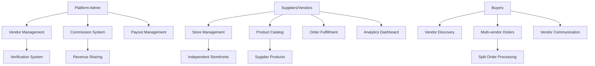

# Multivendor Supplier System Design

## Overview

This design document outlines the architecture and implementation approach for transforming the current B2B marketplace from an admin-only product management system into a comprehensive multivendor platform. The system will enable independent suppliers to register, manage their own stores, list products, and conduct business directly with buyers while maintaining platform oversight and commission management.

## Architecture

### Current System Analysis

The existing system has:
- **Users Table**: Basic user management with buyer/admin roles
- **Products Table**: Admin-managed product catalog
- **Orders/Inquiries/RFQs**: B2B transaction flows
- **Categories**: Product categorization
- **Authentication**: Session-based auth with Passport.js
- **Frontend**: React with Wouter routing, shadcn/ui components
- **Backend**: Express.js with Drizzle ORM and PostgreSQL

### Target Architecture

The multivendor system will extend the current architecture with:



## Components and Interfaces

### 1. Database Schema Extensions

#### Supplier Profiles Table
```sql
CREATE TABLE supplier_profiles (
  id VARCHAR PRIMARY KEY DEFAULT gen_random_uuid(),
  user_id VARCHAR NOT NULL UNIQUE REFERENCES users(id),
  
  -- Business Information
  business_name VARCHAR NOT NULL,
  business_type VARCHAR NOT NULL, -- manufacturer, trading_company, wholesaler
  store_name VARCHAR UNIQUE NOT NULL,
  store_slug VARCHAR UNIQUE NOT NULL,
  store_description TEXT,
  store_logo VARCHAR,
  store_banner VARCHAR,
  
  -- Contact Details
  contact_person VARCHAR NOT NULL,
  position VARCHAR NOT NULL,
  phone VARCHAR NOT NULL,
  whatsapp VARCHAR,
  wechat VARCHAR,
  address TEXT NOT NULL,
  city VARCHAR NOT NULL,
  country VARCHAR NOT NULL,
  website VARCHAR,
  
  -- Business Details
  year_established INTEGER,
  employees VARCHAR,
  factory_size VARCHAR,
  annual_revenue VARCHAR,
  main_products TEXT[],
  export_markets TEXT[],
  
  -- Verification & Status
  verification_level VARCHAR DEFAULT 'none', -- none, basic, business, premium, trade_assurance
  verification_docs JSONB,
  is_verified BOOLEAN DEFAULT false,
  verified_at TIMESTAMP,
  
  -- Membership & Performance
  membership_tier VARCHAR DEFAULT 'free', -- free, silver, gold, platinum
  subscription_id VARCHAR,
  subscription_status VARCHAR,
  subscription_expiry TIMESTAMP,
  
  rating DECIMAL(3,2) DEFAULT 0,
  total_reviews INTEGER DEFAULT 0,
  response_rate DECIMAL(5,2) DEFAULT 0,
  response_time VARCHAR,
  total_sales DECIMAL(15,2) DEFAULT 0,
  total_orders INTEGER DEFAULT 0,
  
  -- Status & Control
  status VARCHAR DEFAULT 'pending', -- pending, approved, rejected, suspended
  is_active BOOLEAN DEFAULT false,
  is_featured BOOLEAN DEFAULT false,
  is_suspended BOOLEAN DEFAULT false,
  suspension_reason TEXT,
  
  -- Commission & Payout
  custom_commission_rate DECIMAL(5,2),
  bank_name VARCHAR,
  account_number VARCHAR,
  account_name VARCHAR,
  paypal_email VARCHAR,
  
  -- Metadata
  total_products INTEGER DEFAULT 0,
  total_inquiries INTEGER DEFAULT 0,
  store_views INTEGER DEFAULT 0,
  followers INTEGER DEFAULT 0,
  
  created_at TIMESTAMP DEFAULT NOW(),
  updated_at TIMESTAMP DEFAULT NOW()
);
```

#### Products Table Extensions
```sql
-- Add supplier_id to existing products table
ALTER TABLE products ADD COLUMN supplier_id VARCHAR REFERENCES supplier_profiles(id);
ALTER TABLE products ADD COLUMN status VARCHAR DEFAULT 'draft'; -- draft, pending_approval, approved, rejected
ALTER TABLE products ADD COLUMN is_approved BOOLEAN DEFAULT false;
ALTER TABLE products ADD COLUMN approved_at TIMESTAMP;
ALTER TABLE products ADD COLUMN approved_by VARCHAR;
ALTER TABLE products ADD COLUMN rejection_reason TEXT;
```

#### Commission Settings Table
```sql
CREATE TABLE commission_settings (
  id VARCHAR PRIMARY KEY DEFAULT gen_random_uuid(),
  
  -- Global Rates
  default_rate DECIMAL(5,2) DEFAULT 5.0,
  free_rate DECIMAL(5,2) DEFAULT 5.0,
  silver_rate DECIMAL(5,2) DEFAULT 3.0,
  gold_rate DECIMAL(5,2) DEFAULT 2.0,
  platinum_rate DECIMAL(5,2) DEFAULT 1.5,
  
  -- Category & Vendor Overrides
  category_rates JSONB, -- {categoryId: rate}
  vendor_overrides JSONB, -- {vendorId: rate}
  
  updated_at TIMESTAMP DEFAULT NOW(),
  updated_by VARCHAR
);
```

#### Orders Table Extensions
```sql
-- Add supplier and commission fields to existing orders table
ALTER TABLE orders ADD COLUMN supplier_id VARCHAR REFERENCES supplier_profiles(id);
ALTER TABLE orders ADD COLUMN parent_order_id VARCHAR REFERENCES orders(id);
ALTER TABLE orders ADD COLUMN commission_rate DECIMAL(5,2);
ALTER TABLE orders ADD COLUMN commission_amount DECIMAL(15,2);
ALTER TABLE orders ADD COLUMN supplier_amount DECIMAL(15,2);
```

#### Payouts Table
```sql
CREATE TABLE payouts (
  id VARCHAR PRIMARY KEY DEFAULT gen_random_uuid(),
  supplier_id VARCHAR NOT NULL REFERENCES supplier_profiles(id),
  order_id VARCHAR REFERENCES orders(id),
  
  amount DECIMAL(15,2) NOT NULL,
  commission_amount DECIMAL(15,2) NOT NULL,
  net_amount DECIMAL(15,2) NOT NULL,
  
  method VARCHAR NOT NULL, -- bank_transfer, paypal, stripe
  status VARCHAR DEFAULT 'pending', -- pending, processing, completed, failed
  
  scheduled_date TIMESTAMP NOT NULL,
  processed_date TIMESTAMP,
  
  transaction_id VARCHAR,
  failure_reason TEXT,
  invoice_url VARCHAR,
  
  created_at TIMESTAMP DEFAULT NOW(),
  updated_at TIMESTAMP DEFAULT NOW()
);
```

#### Supplier Reviews Table
```sql
CREATE TABLE supplier_reviews (
  id VARCHAR PRIMARY KEY DEFAULT gen_random_uuid(),
  supplier_id VARCHAR NOT NULL REFERENCES supplier_profiles(id),
  buyer_id VARCHAR NOT NULL REFERENCES users(id),
  order_id VARCHAR,
  
  overall_rating INTEGER NOT NULL CHECK (overall_rating >= 1 AND overall_rating <= 5),
  product_quality INTEGER,
  communication INTEGER,
  shipping_speed INTEGER,
  after_sales INTEGER,
  
  comment TEXT,
  images TEXT[],
  
  supplier_response TEXT,
  responded_at TIMESTAMP,
  
  is_verified BOOLEAN DEFAULT false,
  is_approved BOOLEAN DEFAULT true,
  helpful_count INTEGER DEFAULT 0,
  
  created_at TIMESTAMP DEFAULT NOW(),
  updated_at TIMESTAMP DEFAULT NOW()
);
```

#### Staff Members Table
```sql
CREATE TABLE staff_members (
  id VARCHAR PRIMARY KEY DEFAULT gen_random_uuid(),
  supplier_id VARCHAR NOT NULL REFERENCES supplier_profiles(id),
  
  email VARCHAR NOT NULL,
  name VARCHAR NOT NULL,
  role VARCHAR NOT NULL, -- owner, manager, product_manager, customer_service, accountant
  permissions JSONB NOT NULL,
  
  is_active BOOLEAN DEFAULT true,
  last_login TIMESTAMP,
  
  created_at TIMESTAMP DEFAULT NOW(),
  updated_at TIMESTAMP DEFAULT NOW()
);
```

### 2. API Routes Structure

#### Supplier Management Routes
```typescript
// Supplier Registration & Profile
POST   /api/suppliers/register
GET    /api/suppliers/profile/:id
PATCH  /api/suppliers/profile/:id
GET    /api/suppliers/dashboard/stats

// Store Management
GET    /api/suppliers/store/:slug
PATCH  /api/suppliers/store/settings
POST   /api/suppliers/store/upload-assets

// Product Management
GET    /api/suppliers/products
POST   /api/suppliers/products
PATCH  /api/suppliers/products/:id
DELETE /api/suppliers/products/:id
POST   /api/suppliers/products/bulk-upload

// Order Management
GET    /api/suppliers/orders
PATCH  /api/suppliers/orders/:id/status
GET    /api/suppliers/orders/:id/details

// Inquiries & RFQs
GET    /api/suppliers/inquiries
POST   /api/suppliers/inquiries/:id/respond
GET    /api/suppliers/rfqs/matching
POST   /api/suppliers/rfqs/:id/quote

// Analytics & Reports
GET    /api/suppliers/analytics/sales
GET    /api/suppliers/analytics/products
GET    /api/suppliers/analytics/customers

// Financial Management
GET    /api/suppliers/earnings
GET    /api/suppliers/payouts
GET    /api/suppliers/commission-history

// Staff Management
GET    /api/suppliers/staff
POST   /api/suppliers/staff
PATCH  /api/suppliers/staff/:id
DELETE /api/suppliers/staff/:id
```

#### Admin Management Routes
```typescript
// Supplier Administration
GET    /api/admin/suppliers
GET    /api/admin/suppliers/pending
POST   /api/admin/suppliers/:id/approve
POST   /api/admin/suppliers/:id/reject
POST   /api/admin/suppliers/:id/suspend

// Product Approval
GET    /api/admin/products/pending
POST   /api/admin/products/:id/approve
POST   /api/admin/products/:id/reject

// Commission Management
GET    /api/admin/commission/settings
PATCH  /api/admin/commission/settings
GET    /api/admin/commission/reports

// Payout Management
GET    /api/admin/payouts/queue
POST   /api/admin/payouts/process
GET    /api/admin/payouts/history

// Platform Analytics
GET    /api/admin/analytics/platform
GET    /api/admin/analytics/suppliers
GET    /api/admin/analytics/revenue
```

#### Buyer-Facing Routes
```typescript
// Supplier Discovery
GET    /api/suppliers
GET    /api/suppliers/:id/profile
GET    /api/suppliers/:id/products
GET    /api/suppliers/:id/reviews

// Store Pages
GET    /api/stores/:slug
GET    /api/stores/:slug/products
GET    /api/stores/:slug/about

// Multi-vendor Shopping
POST   /api/cart/add-multivendor
GET    /api/cart/split-summary
POST   /api/orders/multivendor-checkout
```

### 3. Frontend Component Architecture

#### Supplier Dashboard Components
```typescript
// Main Dashboard
SupplierDashboard/
├── DashboardOverview.tsx
├── QuickActions.tsx
├── PerformanceMetrics.tsx
├── RecentActivity.tsx
└── NotificationCenter.tsx

// Store Management
StoreManagement/
├── StoreProfile.tsx
├── StoreCustomization.tsx
├── StorePolicies.tsx
└── StoreAnalytics.tsx

// Product Management
ProductManagement/
├── ProductList.tsx
├── ProductForm.tsx
├── BulkUpload.tsx
├── ProductAnalytics.tsx
└── InventoryManagement.tsx

// Order Management
OrderManagement/
├── OrderList.tsx
├── OrderDetails.tsx
├── OrderTracking.tsx
└── ShippingManagement.tsx

// Financial Management
FinancialManagement/
├── EarningsOverview.tsx
├── PayoutHistory.tsx
├── CommissionReports.tsx
└── TaxReports.tsx
```

#### Admin Panel Extensions
```typescript
// Supplier Management
AdminSuppliers/
├── SupplierList.tsx
├── SupplierDetails.tsx
├── ApprovalQueue.tsx
├── VerificationManagement.tsx
└── SupplierAnalytics.tsx

// Commission Management
CommissionManagement/
├── CommissionSettings.tsx
├── RateConfiguration.tsx
├── RevenueReports.tsx
└── PayoutQueue.tsx
```

#### Buyer Experience Components
```typescript
// Supplier Discovery
SupplierDiscovery/
├── SupplierDirectory.tsx
├── SupplierCard.tsx
├── SupplierFilters.tsx
└── SupplierComparison.tsx

// Store Pages
StorePage/
├── StoreHeader.tsx
├── StoreNavigation.tsx
├── StoreProducts.tsx
├── StoreAbout.tsx
└── StoreReviews.tsx

// Multi-vendor Shopping
MultivendorShopping/
├── MultivendorCart.tsx
├── SplitOrderSummary.tsx
├── VendorOrderCard.tsx
└── MultivendorCheckout.tsx
```

## Data Models

### Supplier Profile Model
```typescript
interface SupplierProfile {
  id: string;
  userId: string;
  
  // Business Info
  businessName: string;
  businessType: 'manufacturer' | 'trading_company' | 'wholesaler';
  storeName: string;
  storeSlug: string;
  storeDescription?: string;
  storeLogo?: string;
  storeBanner?: string;
  
  // Contact
  contactPerson: string;
  position: string;
  phone: string;
  whatsapp?: string;
  wechat?: string;
  address: string;
  city: string;
  country: string;
  website?: string;
  
  // Business Details
  yearEstablished?: number;
  employees?: string;
  factorySize?: string;
  annualRevenue?: string;
  mainProducts?: string[];
  exportMarkets?: string[];
  
  // Verification
  verificationLevel: 'none' | 'basic' | 'business' | 'premium' | 'trade_assurance';
  verificationDocs?: any;
  isVerified: boolean;
  verifiedAt?: Date;
  
  // Membership
  membershipTier: 'free' | 'silver' | 'gold' | 'platinum';
  subscriptionId?: string;
  subscriptionStatus?: string;
  subscriptionExpiry?: Date;
  
  // Performance
  rating: number;
  totalReviews: number;
  responseRate: number;
  responseTime?: string;
  totalSales: number;
  totalOrders: number;
  
  // Status
  status: 'pending' | 'approved' | 'rejected' | 'suspended';
  isActive: boolean;
  isFeatured: boolean;
  isSuspended: boolean;
  suspensionReason?: string;
  
  // Financial
  customCommissionRate?: number;
  bankName?: string;
  accountNumber?: string;
  accountName?: string;
  paypalEmail?: string;
  
  // Metadata
  totalProducts: number;
  totalInquiries: number;
  storeViews: number;
  followers: number;
  
  createdAt: Date;
  updatedAt: Date;
}
```

### Commission System Model
```typescript
interface CommissionSettings {
  id: string;
  
  // Global Rates
  defaultRate: number;
  freeRate: number;
  silverRate: number;
  goldRate: number;
  platinumRate: number;
  
  // Overrides
  categoryRates?: Record<string, number>;
  vendorOverrides?: Record<string, number>;
  
  updatedAt: Date;
  updatedBy?: string;
}

interface CommissionCalculation {
  orderId: string;
  supplierId: string;
  orderAmount: number;
  commissionRate: number;
  commissionAmount: number;
  supplierAmount: number;
  calculatedAt: Date;
}
```

### Payout System Model
```typescript
interface Payout {
  id: string;
  supplierId: string;
  orderId?: string;
  
  amount: number;
  commissionAmount: number;
  netAmount: number;
  
  method: 'bank_transfer' | 'paypal' | 'stripe';
  status: 'pending' | 'processing' | 'completed' | 'failed';
  
  scheduledDate: Date;
  processedDate?: Date;
  
  transactionId?: string;
  failureReason?: string;
  invoiceUrl?: string;
  
  createdAt: Date;
  updatedAt: Date;
}
```

## Error Handling

### Supplier Registration Errors
- Duplicate store name/slug handling
- Business verification document validation
- Email/phone verification requirements
- Geographic restrictions (if any)

### Product Management Errors
- Product approval workflow errors
- Image upload and processing failures
- Bulk upload validation errors
- Inventory synchronization issues

### Order Processing Errors
- Split order creation failures
- Commission calculation errors
- Supplier notification failures
- Payment processing issues

### Payout System Errors
- Insufficient balance handling
- Bank account validation errors
- Payment gateway failures
- Currency conversion issues

## Testing Strategy

### Unit Tests
- Commission calculation logic
- Payout processing algorithms
- Supplier verification workflows
- Product approval processes

### Integration Tests
- Multi-vendor order flow end-to-end
- Supplier registration and approval process
- Payment and payout system integration
- Email notification systems

### Performance Tests
- Large supplier catalog browsing
- Bulk product upload processing
- Multi-vendor checkout performance
- Analytics dashboard loading

### Security Tests
- Supplier data isolation
- Financial data protection
- Admin privilege escalation prevention
- API rate limiting and abuse prevention

## Implementation Phases

### Phase 1: Core Supplier System (Weeks 1-3)
- Supplier registration and profile management
- Basic store creation and customization
- Product listing with supplier attribution
- Admin approval workflows

### Phase 2: Financial System (Weeks 4-5)
- Commission calculation and tracking
- Payout system implementation
- Financial reporting and analytics
- Tax and accounting integration

### Phase 3: Enhanced Features (Weeks 6-7)
- Supplier verification system
- Staff management and permissions
- Advanced analytics and reporting
- Performance monitoring and optimization

### Phase 4: Buyer Experience (Weeks 8-9)
- Supplier directory and discovery
- Multi-vendor shopping cart
- Split order processing
- Supplier reviews and ratings

### Phase 5: Advanced Features (Weeks 10-12)
- Subscription and membership tiers
- Advanced marketing tools for suppliers
- API integrations and webhooks
- Mobile app considerations

This design provides a comprehensive foundation for implementing the multivendor supplier system while maintaining compatibility with the existing B2B marketplace infrastructure.